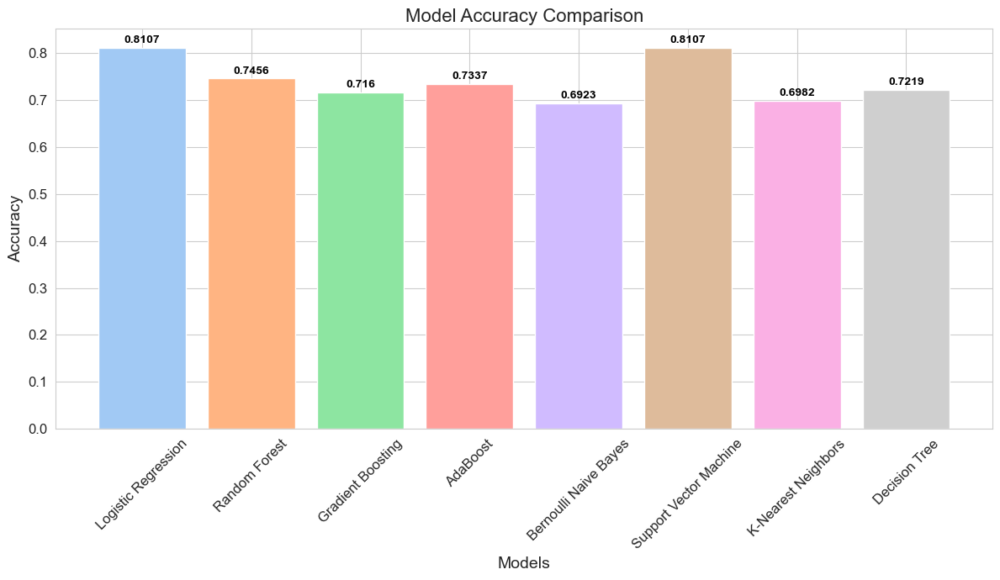
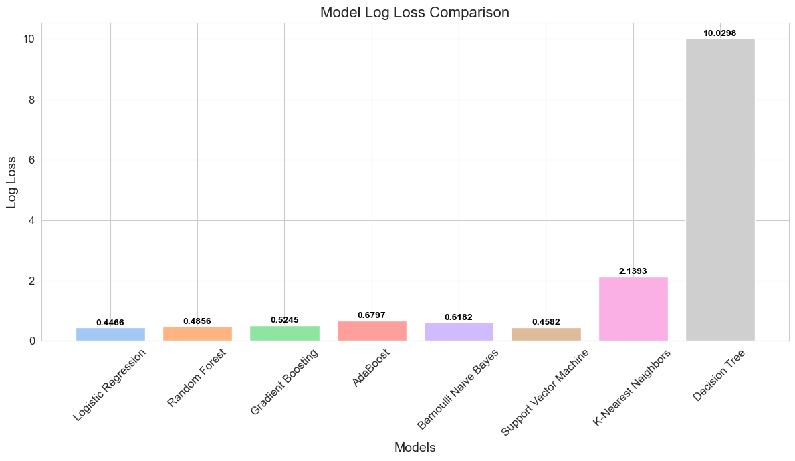
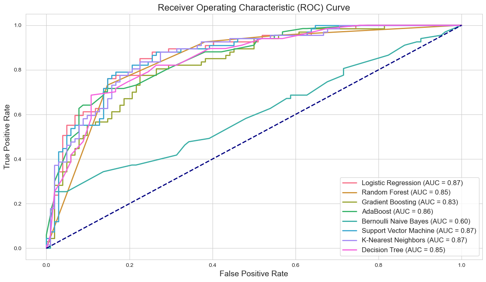

# Forecasting Web Traffic Potential: An End-to-End Machine Learning Approach

## Introduction

In the realm of digital marketing, the ability to predict website traffic potential is invaluable. Our project, Traffic Potential Forecasting, leverages a suite of machine learning models to forecast the traffic potential of various online content. This work is situated at the intersection of data science and digital marketing, embodying a rigorous, methodologically sound approach to predictive analytics.

Through meticulous data cleaning, comprehensive feature engineering, and advanced model optimization, we have cultivated predictive models that offer insights with both precision and depth. Below, we showcase the empirical results of our machine learning models, offering a visual testimony to their predictive prowess and setting the stage for the detailed explanations that follow.

### Comparative Performance Visualizations

The visualizations below serve as a prelude to the detailed technical discourse, highlighting the empirical successes achieved through our analytical rigor.

#### Model Accuracy Comparison

*Figure 1: Bar chart comparison of model accuracies, revealing the effectiveness of various algorithms in predicting traffic potential. Notably, Logistic Regression and Support Vector Machine have surfaced as the frontrunners in accuracy.*

#### Model Log Loss Comparison

*Figure 2: Log loss comparison across models, providing insight into the predictive confidence of each model. Models with the lower log loss, particularly Logistic Regression and Support Vector Machine, demonstrate a higher predictive reliability.*

#### Receiver Operating Characteristic (ROC) Curve

*Figure 3: ROC curves illustrate the true versus false positive rates of our models. Logistic Regression and Support Vector Machine models stand out, underscoring their superior discriminative capabilities with higher AUC values.*

As we unravel the layers of this project, from data preprocessing to model evaluation, the following sections will guide you through the theoretical foundations, practical implementations, and nuanced interpretations that underpin our analytical journey.

## Data Analysis and Visualization

In this section, we delve into the rigorous methodologies employed for data analysis and visualization in the Traffic Potential Forecasting project. Our approach is grounded in robust statistical techniques and advanced data visualization strategies.

### Outlier Detection Techniques

#### Calorie-Based Outlier Identification
We developed a novel approach to identify outliers in nutritional data, focusing on calorie counts in relation to other macronutrients. This method aids in pinpointing implausible calorie values, enhancing the data quality for subsequent analysis.

#### Interquartile Range (IQR) for Outlier Detection
Employing the Interquartile Range (IQR) method, we systematically identified outliers across multiple nutritional parameters. This statistical technique is pivotal in mitigating the effects of extreme values, thereby stabilizing the dataset.

### Advanced Data Visualization

#### Interactive 3D Scatter Plot
Utilizing Plotly Express, we created an interactive 3D scatter plot to dynamically represent the relationship between various nutritional factors and traffic levels. This visualization provides an intuitive and exploratory view of the data structure.

#### Bubble Chart for Multi-dimensional Analysis
We harnessed the power of bubble charts to investigate the interplay between calories, protein, and sugar content. The size-variable feature of the bubbles offers an additional layer of analytical depth, representing sugar content in a visually impactful manner.

### Correlation Analysis

#### Pre-Transformation Correlation Heatmap
A comprehensive correlation analysis was conducted prior to data transformation. Through heatmaps, we visualized the interdependencies between different nutritional features, laying the groundwork for informed transformation decisions.

### Data Transformation Strategies

#### Box-Cox Transformation
To address distribution skewness, we implemented the Box-Cox transformation on selected features. This transformation is crucial in normalizing the data, thus enhancing the robustness of our machine learning models.

### Mahalanobis Distance for Multivariate Outlier Detection
Incorporating the Mahalanobis Distance calculation enabled us to detect outliers in a multivariate context, adding an extra layer of rigor to our data quality assessment.

### Discretization of Continuous Variables
Our approach also involved the discretization of continuous variables into categorical bins. This technique facilitates a more nuanced analysis, particularly in categorical machine learning models.

## Model Development

This section outlines the comprehensive methodologies applied in the model development phase of the Traffic Potential Forecasting project.

### Dataset Preparation

We devised a systematic approach to prepare the dataset for modeling. This involved encoding categorical variables and splitting the data into training and test sets. A stratified split ensured the proportionate representation of target classes in both sets, thereby maintaining the integrity of the dataset distribution.

### Model Training

A diverse range of machine learning models were trained, encompassing logistic regression, random forests, gradient boosting, AdaBoost, Bernoulli Naive Bayes, support vector machines, k-nearest neighbors, and decision trees. Each model was fitted using a customized function that encapsulated the training process, ensuring consistency and reproducibility.

### Model Performance Assessment

We evaluated the models using a multi-metric approach. Metrics such as accuracy, precision, recall, F1 score, and log loss were employed. For binary classification tasks, ROC AUC was calculated, along with ROC curves to visualize performance trade-offs. A unique aspect was the use of classification reports, translated into heatmaps for an intuitive understanding of model performance across different classes.

### Feature Importance Analysis

Understanding the impact of different features on the model predictions was crucial. We utilized both built-in feature importance methods and permutation importance, depending on the model's characteristics. This analysis provided insights into the most influential factors driving the predictions.

### Hyperparameter Optimization

Hyperparameter tuning was carried out using Randomized Search with cross-validation. A diverse range of hyperparameters was explored for each model, tailored to their specific characteristics. The optimized models were then retrained, fine-tuning them to achieve peak performance.

### Visualization of Model Metrics

The project included visual representations of model performance metrics and feature importances. These visualizations facilitated an easy comparison of models and an understanding of the key drivers of their predictions.